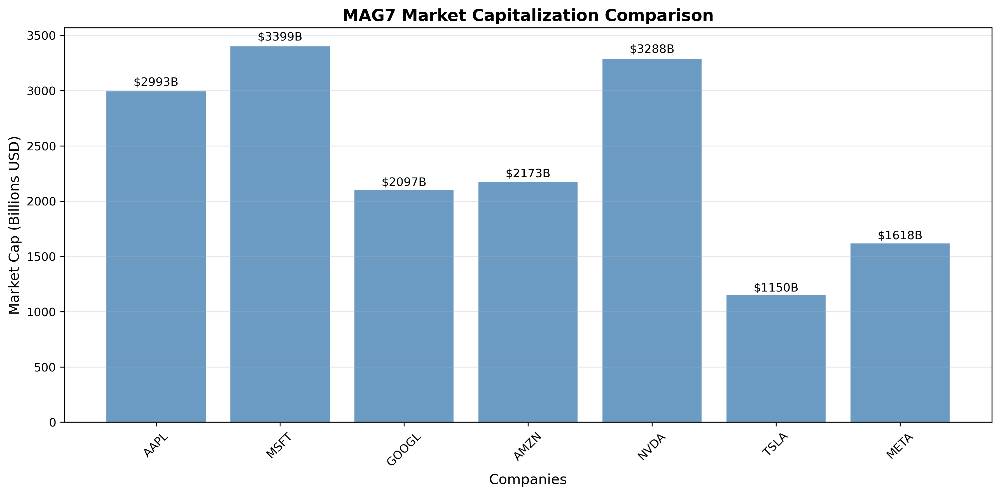
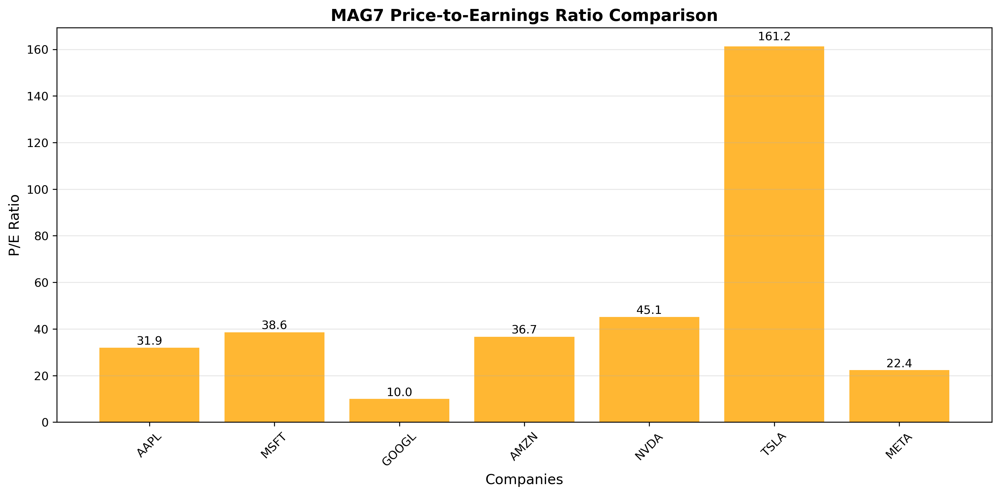
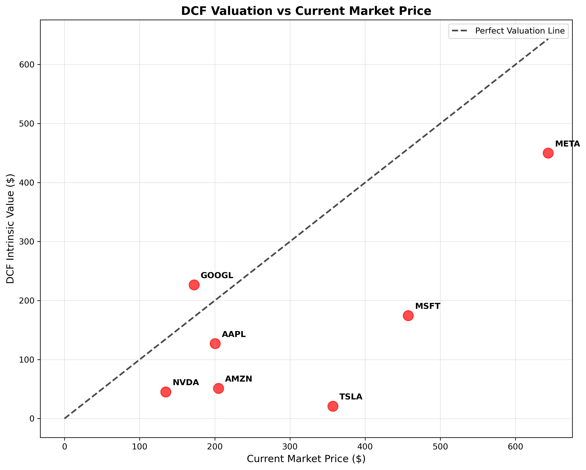
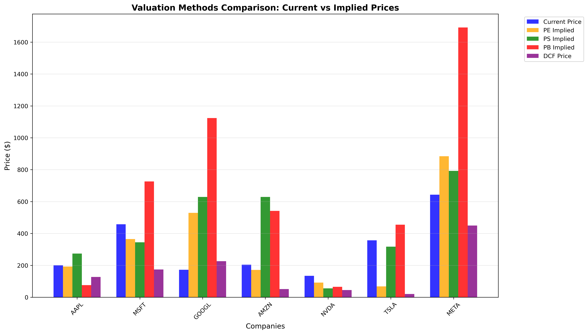
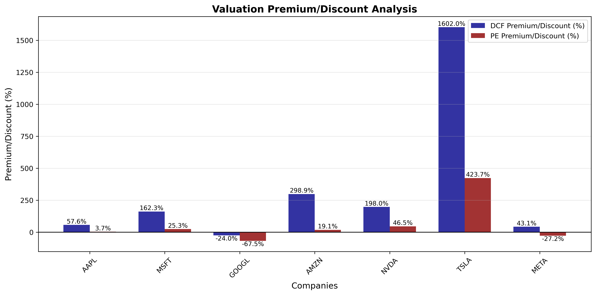
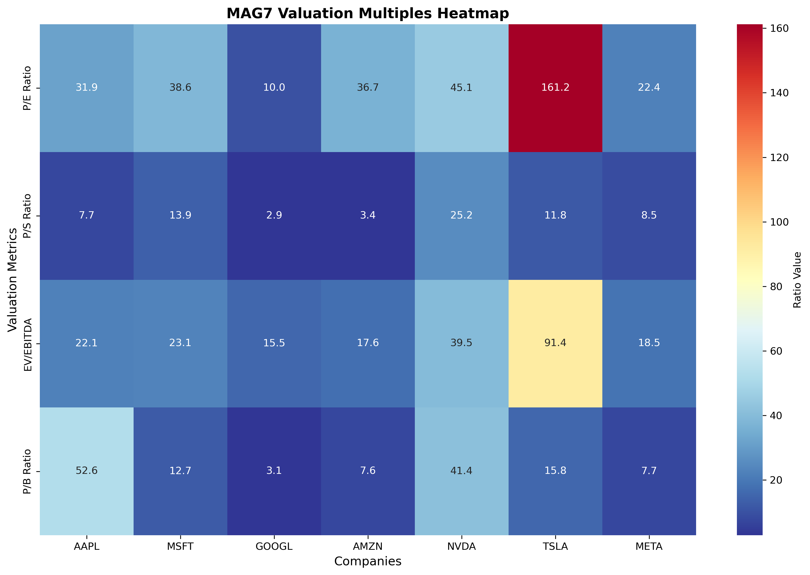

# MAG7 Valuation Model

This repository provides a comprehensive valuation framework for the "Magnificent Seven" (MAG7) technology companies:  
**Apple (AAPL), Microsoft (MSFT), Alphabet (GOOGL), Amazon (AMZN), Meta (META), Tesla (TSLA), and NVIDIA (NVDA)**.

The model integrates five core valuation methodologies to compare intrinsic and relative values across these market leaders.

---

## Objective

To evaluate and benchmark the valuation of MAG7 companies using a structured approach involving:
- Intrinsic valuation models
- Market-based comparables
- Strategic M&A precedents

---

## 🧮 Valuation Methods Included

### 1. **Discounted Cash Flow (DCF)**
- Projects future free cash flows and discounts them using WACC
- Best for: Apple, Microsoft, Meta (predictable cash flows)

### 2. **Comparable Company Analysis (CCA)**
- Uses EV/Sales and EV/EBITDA multiples
- Useful for benchmarking Meta, Alphabet, and NVIDIA

### 3. **Precedent Transactions**
- Includes recent M&A activity in adjacent verticals
- Provides context but limited direct applicability for MAG7

### 4. **Market Capitalization**
- Quick market-based valuation snapshot
- Reflects investor sentiment and size

### 5. **EV/EBITDA Multiple**
- Adjusts for leverage, great for comparing Amazon, Tesla, and high CapEx firms

---

## 🧾 Files Included

| File                          | Description                                                  |
|-------------------------------|--------------------------------------------------------------|
| `MAG7 Valuation Model.ipynb`  | Jupyter notebook with full implementation of the valuation models |
| `02_market_cap_comparison.png`       | Comparison of Market Cap between MAG7 Companies                   |
| `03_pe_ratio_comparison.png`         | Comparison of Price to Earnings Ratios between MAG7 Companies     |
| `04_dcf_vs_current_price.png`        | Comparison of DCF Valuation to Current Market Prices              |
| `05_valuation_methods_comparison.png`| Comparison of Different Valuation Models used on MAG7             |
| `06_premium_discount_analysis.png`   | Comparative Analysis of the Valuation Premium                     |
| `07_valuation_multiples_heatmap.png` | MAG7 Valuation Multiples Heatmap                                  |

---

## 🚀 How to Run

1. Clone the repo
2. Open the `MAG7 Valuation Model.ipynb` notebook
3. Install dependencies if needed:
    ```bash
    pip install pandas numpy matplotlib yfinance
    ```
4. Run all cells to generate comparative valuation charts and insights

---

## 📈 Output

- DCF valuations per company
- Relative value matrices
- EV/EBITDA and EV/Sales comparison plots
- Summary table across all valuation methods

---

## 🖼️ Visualizations

### Market Capitalization Comparison


### Price-to-Earnings Ratio Comparison


### DCF Valuation vs Current Market Price


### Valuation Methods Comparison: Current vs Implied Prices


### Premium/Discount Analysis


### Valuation Multiples Heatmap


---

## 📌 Insights

- Apple and Microsoft show strong intrinsic value support via DCF
- Amazon and Tesla’s valuation rely heavily on future growth (EV-based methods)
- NVIDIA trades at premium multiples reflecting AI-driven expectations

---

## 🧠 Author

Dakshita Srinivasan  
**Last Updated:** May 2025  
*For academic and educational use*
